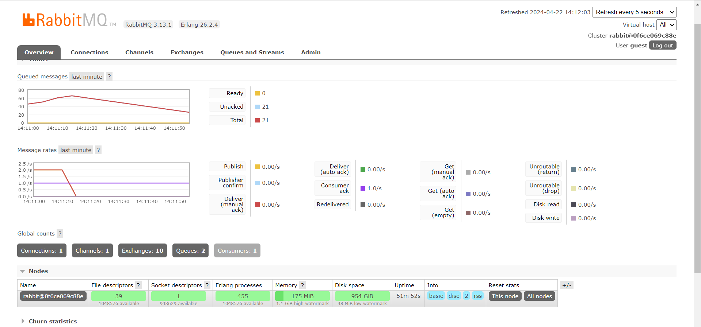

**Syauqi Armanaya Syaki** 
**2206829010** 
**Pemrograman Lanjut C** 

a. what is amqp?

AMQP atau Advanced Message Queuing Protocol merupakan sebuah protokol jaringan untuk melakukan pengiriman dan penerimaan pesan antara sistem yang terpisah, pada kasus ini seperti subscriber dan publisher. Dengan AMQP maka sistem antar layanan dapat diimplementasikan dengan efisien.

b. what it means? `guest:guest@localhost:5672` , what is the first quest, and what is the second guest, and what is `localhost:5672` is for? 

`guest:guest@localhost:5672` merupakan bagian URL yang digunakan untuk menghubungkan ke server AMQP RabbitMQ. Arti dari `guest` yang pertama adalah sebagai username pengguna untuk autentikasi ke server AMQP RabbitMQ. Lalu `guest` kedua merupakan password yang sesuai dengan username yang ada untuk melakukan autentikasinya. Lalu `localhost:5672` sebagai alamat host dan nomor port dari RabbitMQ, lebih rincinya `localhost` menandakan server AMQP berjalan di mesin lokal dan `5672` sebagai port default protokol AMQP.

**Bukti simulasi slow subscriber:**

Berdasarkan bukti yang terlampir diatas, pada waktu tertentu terdapat 20-80 queued message yang dapat terjadi karena perubahan yang dilakukan di subscriber sehingga menerima message lebih lama dari biasanya. Perubahan tersebut menyebabkan penumpukan message karena subscriber tidak bisa menerima pesan secepat publisher mengirim pesan. Jadi ketika melakukan run berulang pada publisher, maka subscriber akan memiliki beban yang berlebih karena banyak pesan yang harus diproses sekaligus. Kesimpulannya, jika terdapat ketidakseimbangan kecepatan antara mengirim dan membaca pesan antara publisher dan subscriber, maka akan menyebabkan antrian message yang berlebihan.